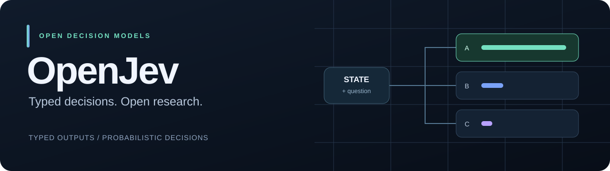

<p align="center">
  
</p>

<p align="center">
  <strong>Open models for typed, probabilistic decisions.</strong><br />
  Decisions and probabilities your software can act on.
</p>

<p align="center">
  <a href="LICENSE"></a>
  <a href="ROADMAP.md"></a>
  <a href="ROADMAP.md"></a>
</p>

<p align="center">
  English · <a href="README.zh-CN.md">简体中文</a> · <a href="docs/README.md">Documentation</a> · <a href="ROADMAP.md">Roadmap</a> · <a href="CONTRIBUTING.md">Contribute</a>
</p>

> **First model preview — within the next few days.**
> The preview will include model weights, inference examples, and initial evaluation results. See the [roadmap](ROADMAP.md).

The repository currently contains the architecture and training plans. Code and model weights are coming with the preview.

## Why OpenJev?

Routing a ticket, checking a policy, or scoring a report should fit into an ordinary function call. OpenJev is designed to read the state, question, and allowed outcomes, then return a decision with a probability distribution.

Your code chooses the thresholds and handles uncertain cases. The model scores candidates directly, without generating an answer string.

The work focuses on four areas:

- **Typed decisions:** choose from caller-defined outcomes, with deterministic validation and postprocessing.
- **Probability quality:** train with verified labels and probability targets, then calibrate on held-out data.
- **Efficient inference:** avoid vocabulary decoding and investigate sharing state and question computation across decisions.
- **Reproducible research:** publish model artifacts, configurations, evaluation procedures, and the limits of each release.

OpenJev is an independent project inspired by Jev's public descriptions. It has no affiliation with TypeSafe AI or Qwen. Our architecture and training method are described below.

## What does a decision look like?

Three planned primitives share one scoring model:

| Primitive | Question shape | Intended output |
| --- | --- | --- |
| **Choice** | Which of these options fits? | Selected option ID and a probability for every option |
| **Score** | Where does this input fall on described levels? | Level probabilities, a weighted score, and distribution variance |
| **Noul** | Is this statement true? | Probability of the answer being yes |

For a support ticket, the conceptual flow is:

```text
State:      "Tracking says delivered, but I haven't received my parcel."
Question:   "Which team should handle this first?"
Candidates: shipping / billing / returns

Model → candidate scores → probabilities → routing code
```

Proposed output format, with example probabilities:

```json
{
  "type": "choice",
  "selected_id": "shipping",
  "probabilities": {
    "shipping": 0.90,
    "billing": 0.03,
    "returns": 0.07
  },
  "top_probability": 0.90,
  "margin": 0.83
}
```

Output validation ensures legal values; held-out evaluation measures decision quality and workflow risk.

## Technical approach


### Candidate scoring

Keep the Qwen3-1.7B-Base embeddings and Transformer blocks. Add structural tokens and a shared **2048 → 1** scoring head. Read each candidate's hidden state at an input-side `DECISION` position; skip the vocabulary LM head and free-text generation.

Candidate names and descriptions are supplied at runtime, so the same head can score different task definitions.

### Candidate context

- **A — independent candidates:** each score sees the state, question, and its own candidate description.
- **B — full candidate context:** each score also sees the complete candidate set, enabling relative comparisons and dynamic `other` semantics.

The pilot will compare both structures on unseen tasks, changing taxonomies, overlapping categories, and fallback options. Score uses independently described levels; Noul uses true/false branches.

### Probability supervision

Use verified hard labels, observed outcomes, known conditional distributions, carefully weighted teacher supervision, and audited human distributions. Train with per-question cross-entropy; evaluate optional Brier and consistency losses through ablations.

Separate model training, temperature fitting, workflow threshold selection, and final testing. A distribution's concentration is not its probability of being correct, and separately calibrated questions do not automatically form a reliable workflow.

### Shared computation

Start with ordinary causal forwards. After validating capability, investigate a **state → question → candidate** attention tree with path-based RoPE positions and shared prefix computation.

We will check reference equivalence for logits, loss, and gradients, then measure latency and memory against baselines that include prefix caching.

## Training roadmap

| Stage | Work | Initial data budget |
| --- | --- | --- |
| Task definition | Freeze task semantics, data splits, workflows, and baselines | Representative real cases and rule-based examples |
| Adaptation | Learn the scoring head, structural tokens, and decision instructions | 20K–50K high-quality decisions |
| Pilot | Compare candidate structures, initialization, and supervision | About 100K unique training decisions |
| Engineering | Check shared-computation equivalence and performance | Pilot examples and boundary cases |
| Main training | Expand task coverage and distill capabilities | 0.5M–2M unique training decisions |
| Refinement | Address verified hard cases with ordinary-data replay | 100K–300K hard cases plus replay |
| Calibration and evaluation | Fit temperature, select workflow thresholds, test the frozen system | Separate calibration, policy, and test sets |

The budgets above are planned. A decision is one question with its complete candidate set. The preview's model card will report its actual training data and completed stages.

## Getting started

Start with the [design overview](docs/openjev_qwen3_design.md), then read the [architecture](docs/openjev_model_architecture.md) and [training pipeline](docs/openjev_training_pipeline.md). The detailed research documents are currently in Chinese; contributions to English translations are welcome.

Model downloads and inference instructions will accompany the preview. Release information lives in the [model card](docs/MODEL_CARD.md).

Check the documentation locally with **Python 3.10+**; no extra dependencies are needed:

```bash
python3 scripts/check_docs.py
```

## Documentation

| Document | Contents |
| --- | --- |
| [Design overview](docs/openjev_qwen3_design.md) | Research decisions, constraints, and milestones |
| [Model architecture](docs/openjev_model_architecture.md) | Input compilation, A/B structures, attention, scoring, and inference |
| [Training pipeline](docs/openjev_training_pipeline.md) | Nine execution steps, eight data recipes, objectives, and exit criteria |
| [Roadmap](ROADMAP.md) | Model preview commitment and longer-term work |
| [Model card](docs/MODEL_CARD.md) | Model status, training details, evaluation, and limitations |
| [Release guide](docs/RELEASING.md) | Artifacts and evidence required for a reproducible release |
| [Changelog](CHANGELOG.md) | Changes and actual releases |

## Contributing

We welcome architecture reviews, data generators and verifiers, reference implementations, evaluation tasks, documentation improvements, and translations. Start with [CONTRIBUTING.md](CONTRIBUTING.md); issues and pull requests can be written in English or Chinese.

Use Issues for bugs, proposals, and research discussions. Please follow the [Code of Conduct](CODE_OF_CONDUCT.md) and use the [security reporting process](SECURITY.md) for sensitive issues.

## License and citation

Original OpenJev contributions are available under [Apache-2.0](LICENSE). Third-party research excerpts and upstream artifacts retain their own terms; see [NOTICE](NOTICE) and [third-party notices](THIRD_PARTY_NOTICES.md). Each model release will document its exact artifact license and upstream requirements.

To cite this project, use [CITATION.cff](CITATION.cff). A versioned model citation will be added when a model is released.

## Acknowledgements

We thank the [State Key Laboratory for Novel Software Technology](https://cs.nju.edu.cn/cs_en/52964/list.htm) and the [Institute of Machine Learning and Data Mining (LAMDA), Nanjing University](https://www.lamda.nju.edu.cn/) for providing computing resources for OpenJev.

We also thank the Qwen team for the base model and TypeSafe AI for sharing the System One model direction.
