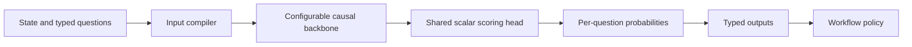

<p align="center">
  
</p>

<p align="center">
  <strong>Open models for typed, probabilistic decisions.</strong><br />
  Decisions and probabilities your software can act on.
</p>

<p align="center">
  <a href="LICENSE"></a>
  <a href="ROADMAP.md"></a>
  <a href="ROADMAP.md"></a>
</p>

<p align="center">
  English · <a href="README.zh-CN.md">简体中文</a> · <a href="docs/README.md">Documentation</a> · <a href="ROADMAP.md">Roadmap</a> · <a href="CONTRIBUTING.md">Contribute</a>
</p>

> **First model preview — coming soon.**
> The preview will include model weights, inference examples, and initial evaluation results. See the [roadmap](ROADMAP.md).

The repository contains architecture and training plans, a [conversation data pipeline](docs/openjev_training_pipeline.md), and local corpus preparation, offline data checks, and a reference scorer. The public input compiler, typed CLI/HTTP responses, PiSSA model/checkpoint components, and teacher codebook audit are implemented. The old hard-label pipeline is archived. API question synthesis, semantic review, offline replay and local teacher collection are implemented; training-set approval and the soft-target trainer are still pending. A formally trained OpenJev model has not been released.

## Why OpenJev?

Routing a ticket, checking a policy, or scoring a report should fit into an ordinary function call. OpenJev is designed to read the state, question, and allowed outcomes, then return a decision with a probability distribution.

Your code chooses the thresholds and handles uncertain cases. The model scores candidates directly, without generating an answer string.

The work focuses on four areas:

- **Typed decisions:** choose from caller-defined outcomes, with deterministic validation and postprocessing.
- **Probability quality:** train with verified labels and probability targets, then calibrate on held-out data.
- **Efficient inference:** avoid vocabulary decoding and investigate sharing state and question computation across decisions.
- **Reproducible research:** publish model artifacts, configurations, evaluation procedures, and the limits of each release.

OpenJev is an independent project inspired by Jev's public descriptions. It has no affiliation with TypeSafe AI or Qwen. Our architecture and training method are described below.

## What does a decision look like?

Three primitives share one scoring model; their interfaces are implemented, with model quality still to be validated:

| Primitive | Question shape | Intended output |
| --- | --- | --- |
| **Choice** | Which of these options fits? | Selected option name and a probability for every option |
| **Score** | Where does this input fall on described levels? | Level probabilities, weighted score, legend, and confidence |
| **Noul** | Is this statement true? | Probability of the answer being yes |

Requests follow Jev’s `state + questions` structure, with options in `criteria`.

```json
{
  "model": "openjev-preview",
  "state": "Tracking says delivered, but I have not received my parcel.",
  "questions": {
    "route": {
      "type": "choice",
      "instructions": "Which team should handle this first?",
      "criteria": {
        "shipping": "Delivery and missing parcels",
        "billing": "Charges and invoices",
        "returns": "Returns of received items"
      }
    }
  }
}
```

Response shape with illustrative probabilities; the local API is implemented, and no trained model has been released:

```json
{
  "model": "openjev-preview",
  "answers": {
    "route": {
      "type": "choice",
      "choice": "shipping",
      "confidence": 0.83,
      "probabilities": {"shipping": 0.90, "billing": 0.03, "returns": 0.07}
    }
  },
  "usage": {"input_tokens": 210, "output_tokens": 31}
}
```

`confidence` uses OpenJev’s top-two probability margin. It is not an accuracy estimate or a reproduction of Jev’s formula. See the [API contract](docs/openjev_api_contract.md) for fields and compatibility limits.

## Technical approach



### Candidate scoring

Keep the selected backbone’s embeddings and Transformer blocks. Add structural tokens and a shared **hidden_size → 1** scoring head. Pin the checkpoint and tokenizer for each experiment. Read each candidate's hidden state at an input-side `DECISION` position; skip the vocabulary LM head and free-text generation.

Candidate names and descriptions are supplied at runtime, so the same head can score different task definitions.

### Candidate context

- **A — independent candidates:** each score sees the state, question, and its own candidate description.
- **B — full candidate context:** each score also sees the complete candidate set, enabling relative comparisons and dynamic `other` semantics.

The first run uses B; A remains a later comparison on unseen tasks, changing taxonomies, overlapping categories, and fallback options. Score uses independently described levels; Noul uses true/false branches.

### Probability supervision

An LLM API constructs questions and options from existing conversations. After JSON and semantic validation, a local teacher reasons and scores every candidate; the student learns directly from these soft distributions with PiSSA. Teacher reasoning and temporary answer codes stay out of student inputs. Question synthesis and local collection have runnable entrypoints, with raw responses, reasoning traces and logits retained for audit. The [canary report](docs/data_audit/pipeline_canary.md) records actual coverage and rejected examples. No soft-label dataset has been approved for training.

Separate model training, temperature fitting, workflow threshold selection, and final testing. A distribution's concentration is not its probability of being correct, and separately calibrated questions do not automatically form a reliable workflow.

### Shared computation

Start with ordinary causal forwards. After validating capability, investigate a **state → question → candidate** attention tree with path-based RoPE positions and shared prefix computation.

We will check reference equivalence for logits, loss, and gradients, then measure latency and memory against baselines that include prefix caching.

## Training roadmap

| Stage | Work | First preview |
| --- | --- | --- |
| 1. Prepare data | Chat extraction → API question construction → JSON/semantic checks → local teacher reasoning and complete probabilities → freeze | Review about 100 decisions before expanding to 1K–3K; cover 2–255 candidates |
| 2. Direct PiSSA distillation | Jointly train low-rank parameters, scoring head and structural tokens using teacher distributions | No hard-label warmup |
| 3. Validate | Development evaluation, independent calibration, policy selection and final testing | Report quality, cost and supported scope |

The first preview follows **1 → 2 → 3**. RLCD is future research outside these stages. Standard PiSSA freezes the residual base while its low-rank component changes the effective backbone weights. There is no separate head warmup or preceding LoRA run. Implementation gaps and parameter scope are recorded in the [training plan](docs/openjev_training_pipeline.md).

## Getting started

Start with the [design overview](docs/openjev_design.md), then read the [architecture](docs/openjev_model_architecture.md) and [training pipeline](docs/openjev_training_pipeline.md). The detailed research documents are currently in Chinese; contributions to English translations are welcome.

Local inference commands are in the [execution guide](docs/execution.md); model downloads will accompany the preview. Release information lives in the [model card](docs/MODEL_CARD.md).

Check the documentation locally with **Python 3.10+**; no extra dependencies are needed:

```bash
python3 scripts/check_docs.py
```

## Documentation

| Document | Contents |
| --- | --- |
| [Design overview](docs/openjev_design.md) | Research decisions, constraints, and milestones |
| [Model architecture](docs/openjev_model_architecture.md) | Input compilation, A/B structures, attention, scoring, and inference |
| [Training pipeline](docs/openjev_training_pipeline.md) | Three stages, API question construction, local teacher probabilities, and direct PiSSA distillation |
| [Training data format](docs/openjev_training_data.md) | Unlabeled questions, teacher distributions, provenance, and replay |
| [API contract](docs/openjev_api_contract.md) | Jev request/response fields and OpenJev compatibility limits |
| [Roadmap](ROADMAP.md) | Model preview commitment and longer-term work |
| [Model card](docs/MODEL_CARD.md) | Model status, training details, evaluation, and limitations |
| [Release guide](docs/RELEASING.md) | Artifacts and evidence required for a reproducible release |
| [Changelog](CHANGELOG.md) | Changes and actual releases |

## Contributing

We welcome architecture reviews, data generators and verifiers, reference implementations, evaluation tasks, documentation improvements, and translations. Start with [CONTRIBUTING.md](CONTRIBUTING.md); issues and pull requests can be written in English or Chinese.

Use Issues for bugs, proposals, and research discussions. Please follow the [Code of Conduct](CODE_OF_CONDUCT.md) and use the [security reporting process](SECURITY.md) for sensitive issues.

## License and citation

Original OpenJev contributions are available under [Apache-2.0](LICENSE). Third-party research excerpts and upstream artifacts retain their own terms; see [NOTICE](NOTICE) and [third-party notices](THIRD_PARTY_NOTICES.md). Each model release will document its exact artifact license and upstream requirements.

To cite this project, use [CITATION.cff](CITATION.cff). A versioned model citation will be added when a model is released.

## Acknowledgements

We thank the [State Key Laboratory for Novel Software Technology](https://cs.nju.edu.cn/cs_en/52964/list.htm) and the [Institute of Machine Learning and Data Mining (LAMDA), Nanjing University](https://www.lamda.nju.edu.cn/) for providing computing resources for OpenJev.

We also thank the Qwen team for the base model and TypeSafe AI for sharing the System One model direction.
