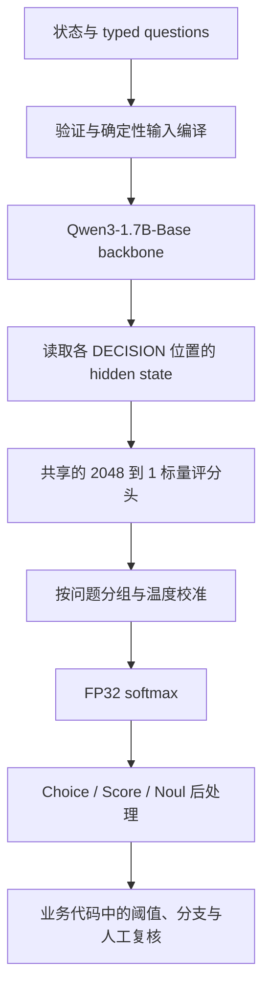

# OpenJev 模型架构详解

日期：2026-09-19。状态：架构设计，待实现与实验验证。

本文展开[总体设计](openjev_qwen3_design.md)中的模型、输入编译、前向计算、输出语义和工程约束。数据制作及训练顺序见[训练流程](openjev_training_pipeline.md)。两份细化文档沿用总体设计的路线：先验证普通 causal forward 的决策能力，再选择 Choice 候选结构，最后优化共享计算。

## 1. 模型究竟要学习什么

OpenJev 学习一个由问题和候选定义条件化的决策函数：

```text
输入：状态 x、问题 q、运行时定义的候选集合 C
输出：候选上的概率分布 p(y | x, q, C)
```

例如状态为“快递显示签收，但客户说没有收到”，问题是“首先交给哪个团队”，候选是物流、账单、退换货。模型直接给出三项分数，转换成概率，由代码返回最大概率对应的团队。

模型不学习输出 JSON 字符串，也不需要在推理时生成答案文字或思维链。所有候选描述和读出位置都已经在输入中。模型做一次或分阶段的判别前向计算，服务层负责构造类型正确的响应。

这给出了三种不同的保证或目标：

| 层面 | 由谁负责 | 可以保证什么 |
| --- | --- | --- |
| 类型和合法值 | 输入验证、候选映射、确定性后处理 | 成功响应只能引用合法候选，数值必须通过检查 |
| 语义判断 | backbone、评分头及训练数据 | 需要实测准确率，不能由类型正确推出 |
| 概率质量与自动化风险 | 概率训练、后校准和工作流评估 | 在明确评估分布上验证，不承诺任意输入都可靠 |

“只能选择合法团队”不代表“总能选择正确团队”。低熵也不证明输入处于模型熟悉的分布。

## 2. 整体计算链



模型内部共享知识和评分头，但不同问题不读取彼此的答案。业务依赖关系由调用方代码表达。如果第二个问题需要第一个问题的实际输出，就应分两次调用，或显式写出第二个问题的条件并由代码决定是否使用该答案。

并行评估问题不等于这些问题的错误统计独立。多个概率不能未经验证就相乘得到工作流成功率。

## 3. Backbone：保留什么，新增什么

主线 checkpoint 为 `Qwen/Qwen3-1.7B-Base`。总体设计记录的配置如下；实现时必须固定 revision 并核对实际加载的 config。

| 配置项 | 设计采用的值 |
| --- | --- |
| Transformer 层数 | 28 |
| hidden size | 2048 |
| FFN intermediate size | 6144 |
| query heads / KV heads | 16 / 8 |
| head dimension | 128 |
| 原词表大小 | 151936 |
| 位置机制 | RoPE |
| attention | causal，GQA，保留 Q/K normalization |
| 输入 embedding 与原 LM head | 权重绑定 |

保留原始 embedding、Transformer 层、MLP、各归一化层以及最终 RMSNorm。新增结构边界 token 的 embedding，以及一个共享线性层：

```text
w ∈ R^2048
z = wᵀh
```

所有 primitive、问题和候选使用同一组 w。问题类型和候选语义通过输入影响 hidden state，不通过固定类别编号选择不同 head。因此新增一个业务类别只需要提供名称和描述，不需要扩展分类头。

不执行原来的词表输出投影，不调用 `generate`。由于原 LM head 与输入 embedding 绑定，这主要减少词表投影计算，不能把同一份 embedding 权重当成可删除的参数。

首版不改成双向 encoder，不增加独立 cross-attention、diffusion 或 latent reasoning 模块。普通 causal 参考计算保留了权重迁移和数值对照的基础。Base 的指令理解必须通过决策训练获得并验证，不能借用后训练版的能力假设。

## 4. 输入契约与编译器

以下为拟定的逻辑输入格式，HTTP API 将在实现阶段确定。

```json
{
  "state": "快递显示签收，但客户说没有收到。",
  "questions": {
    "route": {
      "type": "choice",
      "instructions": "根据客户当前问题，首先交给哪个团队？",
      "candidates": [
        {"id": "shipping", "text": "物流、签收异常与丢件"},
        {"id": "billing", "text": "扣费、账单与发票"},
        {"id": "returns", "text": "已收到商品后的退换货"}
      ]
    }
  }
}
```

`route` 只用于请求与响应对应，不送入模型。这里候选 `id` 同时承担有语义的名称，例如 shipping；名称与 text 一起输入模型。如果未来要支持不透明的数据库 ID，应增加单独的语义名称字段并明确版本，不能假定任意 ID 自带分类含义。

Score 的候选在内部表示为有序档位，外部序号从 0 开始，只用于输出映射。Noul 的内部候选是 true 与 false 的完整语义描述。

### 4.1 编译规则

1. 校验 primitive、候选数、唯一 ID、字符串／结构化值格式和长度。首版服务契约建议 Choice 接受 2–255 项、Score 接受 2–10 档，Noul 固定二元；单候选决策交由调用方代码直接处理。
2. state、instructions、描述中的 object 使用固定序列化规则；普通 list 保留顺序。Choice 的集合规范化是单独规则，不改变 Score 的档位顺序。
3. Choice B 的完整候选列表按唯一 ID 的 Unicode 码点顺序排列，规则写入编译器版本。更改请求中的枚举顺序不会改变这个前缀。
4. 使用专用结构 token 划定状态、问题和候选边界。文中的 `[STATE]` 等只是易读表示；实现时须注册并保存实际 token ID。
5. 用户文本中出现结构 token 的字面量时，按普通文本编码或转义，不能转成编译器的控制 token。
6. 超过路径长度或总打包预算时返回明确错误，或使用预先约定且可追踪的切分流程；不能静默截断证据。

问题指令与 state 的边界有助于区分任务和材料，但不能仅凭特殊 token 保证抵抗提示注入；这仍是数据和评测项目。

### 4.2 训练时不进入输入的字段

标签、目标概率、教师解释、额外证据标注、隐藏模拟状态、数据来源 ID、质量权重和 split 都属于监督或审计元数据，不由输入编译器读取。state 本身包含的可见证据应正常保留；“不输入证据标注”不等于删除原文证据。

编译器应采用允许字段列表构造输入，避免直接序列化整条训练记录导致答案泄漏。部署时没有的属性不能在训练时被隐式使用。

## 5. 两种 Choice 结构

### 5.1 A：独立候选评分

每个候选的普通 causal 路径是：

```text
[固定任务约定]
[STATE] x [/STATE]
[QUESTION] type=choice，q [/QUESTION]
[CANDIDATE] name_k，description_k [/CANDIDATE]
[DECISION]
```

数学上：

```text
z_k = f_theta(x, q, c_k)
p_k = exp(z_k / T) / Σ_l exp(z_l / T)
```

评分时看不到其他候选，但归一化和训练损失使用本题全部候选。独立评分不等于对每个候选单独做一个二元分类。

这个结构能够复用状态和问题前缀，适合类别含义自足的原子判断。但它满足：

```text
p_a / p_b = exp((z_a - z_b) / T)
```

固定 T 时，新增候选不会改变原有两项的相对赔率。因此它不适合无条件承担依赖集合的语义。

最常见的问题是 `other`。如果输入可能属于 A 或 C，真实概率为 0.4／0.6，则 `[A, other]` 的目标应为 0.4／0.6，而 `[A, C, other]` 应为 0.4／0.6／0。A 和 other 的输入不变时，独立结构不能同时表达这两种目标。

固定 taxonomy 可以把兜底描述写成自足的明确规则；动态的“其余选项之外”需要读取集合。是否存在集合依赖不能只靠检测 `other` 这个字符串决定，应由任务契约和审核确定。声明需要集合语义的请求应由 B 处理，或在只支持 A 的服务中明确拒绝。

### 5.2 B：完整候选集合可见

每个 readout 的普通 causal 路径是：

```text
[固定任务约定]
[STATE] x [/STATE]
[QUESTION] type=choice，q
  [CHOICES] 按规范顺序排列的全部候选名称及描述 [/CHOICES]
[/QUESTION]
[CANDIDATE] 当前候选名称及描述 [/CANDIDATE]
[DECISION]
```

数学上：

```text
z_k = f_theta(x, q, C, c_k)
p_k = softmax(z / T)_k
```

每个 readout 可以比较集合中的类别，并理解 `other` 的相对含义。原始 logits 可以随其他候选的变化而变化，这属于正常行为。

B 仍可以共享前缀：状态共享一次，同一问题的完整候选列表共享一次。代价是问题前缀更长，候选列表内部有 causal attention；高候选数可能显著增加计算和路径长度，必须实测。

完整候选列表被规范排序后，请求中的顺序扰动不会进入模型。这个性质来自编译器，不代表 causal backbone 对任意重排都天然不敏感。开发评测应另外更改实际编译顺序，测量模型的次序敏感性。

### 5.3 选型规则

| 比较项 | A | B |
| --- | --- | --- |
| 当前候选可见信息 | state、question、自身描述 | 再增加完整候选集合 |
| 动态补集／相对比较 | 结构上受限 | 有表达通路，能力仍需训练 |
| 共享问题前缀 | 问题指令 | 问题指令与完整候选列表 |
| 修改一个候选的影响 | 其他 raw logits 不变 | 可以影响其他 raw logits |
| 顺序处理 | 分支路径位置不依赖枚举顺序 | 还需规范化完整列表 |

在约 10 万 decision 的 pilot 内比较 A／B。采用相同训练记录、目标和初始权重控制，记录训练 token、计算预算及每题成本，避免把更大预算误当成架构收益。重点查看动态 taxonomy、兜底、重叠类别和未见任务的分组指标。

最终发布的 checkpoint 必须声明所用 Choice 模式和支持范围。不能训练后在 A／B 间随意切换序列化；切换是输入分布变化，需要重新验证并校准。Score 保持档位独立，Noul 保持 true／false 双分支；Choice 选 B 不要求它们也输入完整列表。

## 6. 树形共享：合并相同前缀计算

### 6.1 逻辑节点

```text
S：固定约定 + state
├── Q1：choice 指令；B 时还包含完整候选列表
│   ├── C11：候选 1 + DECISION
│   ├── C12：候选 2 + DECISION
│   └── C13：候选 3 + DECISION
└── Q2：score 指令
    ├── C21：档位描述 0 + DECISION
    └── C22：档位描述 1 + DECISION
```

这里的节点是一段 token，不是神经网络中的独立模块。所有节点通过相同的 28 层 Transformer，只是 attention 可见范围不同。

### 6.2 Attention mask

token t 可以读取 token u，当且仅当：

```text
same_request(t, u) AND (
    node(u) 是 node(t) 的严格祖先
    OR (node(u) == node(t) AND local_pos(u) <= local_pos(t))
)
```

| 查询 token 所在节点 | 可见区域 |
| --- | --- |
| S | 自己的 causal 前缀 |
| Qj | 完整 S 与自己的 causal 前缀 |
| Cjk | 完整 S、完整 Qj 与自己的 causal 前缀 |

其他问题、兄弟 readout、不同请求以及 padding 都不能成为有效可读内容。B 中其他候选描述已经存在 Qj，所以 readout 之间隔离不会阻止候选比较。

### 6.3 RoPE position

position 按根到叶的逻辑路径累计，不按物理打包的全局 offset 分配：

```text
S:   0 ... len(S)-1
Qj:  len(S) ... len(S)+len(Qj)-1
Cjk: len(S)+len(Qj) ... len(S)+len(Qj)+len(Cjk)-1
```

示例：S 长 100，Q1 长 20，Q2 长 10，则 Q1、Q2 都从 100 开始；Q1 的所有候选从 120 开始，Q2 的所有候选从 110 开始。兄弟节点位置可以重复，因为它们不直接互相 attention。

最长路径控制位置与上下文限制，总打包 token 数控制显存和执行预算。B 的候选列表计入 Qj，可能让最长路径先超过限制，即使 state 很短也不能忽略。

### 6.4 为什么与普通 forward 等价

对于相同权重和输入，每条路径上的 token 都读取与普通 causal 拼接相同的前缀，使用相同 position。于是每层可依次得到相同的 hidden state，末端 logits 也应一致；多个完全相同的前缀只需算一次。

训练时，共享前缀收到各个后代分支的梯度之和。必须保持相同的按题 loss 和归约方式，不能把多个候选分别当成独立训练题。

严格的数值／梯度对照要关闭 dropout 等随机算子，或控制为等价随机掩码，并明确 dtype 和容差。不能把浮点归约顺序造成的微小误差与 mask 错误混为一谈。

首版 pilot 使用普通参考实现。通过质量门槛后，才实现明确 dense mask 的小规模对照，再评估稀疏布局。任意树形 mask 不能直接假定由标准三角 causal kernel 正确处理。

## 7. 读出、归一化与训练接口

设某个 batch 含 J 个问题，第 j 题有 K_j 个有效候选：

```text
H_decision: [Σ_j K_j, 2048]
logits:     [Σ_j K_j]
offsets:    [J+1]，记录每题在 logits 中的起止位置
```

这些候选数可不同，不需要固定为 255。读取最终 RMSNorm 之后的 DECISION hidden state，经过同一个标量 head，再按 offsets 分题计算。

```python
# 前向计算伪代码
hidden = backbone(compiled_input)
h = hidden[decision_positions]
z = score_head(h).squeeze(-1).float()

for question in questions:
    z_j = gather_valid_logits(z, question)
    log_p_j = log_softmax(z_j / temperature[question.type])
    probabilities[question.id] = exp(log_p_j)
```

训练时 T=1，主损失直接使用 FP32 的 log_softmax，避免先算概率再取 log 导致下溢。推理和校准使用保存的正温度。共享 scalar bias 会在 softmax 中消掉，首版不添加。

若采用 padding 的矩阵布局，无效候选在 softmax 前排除。不能对全是无效项的一行执行 softmax。出现 NaN／Inf、重复 ID 或候选映射缺失时返回错误，不能偷偷换成均匀分布制造正常响应。

## 8. 三个 primitive 的输出

### 8.1 Choice

```text
selected_id = argmax_k p_k 对应的输入 ID
top_probability = max_k p_k
margin = 第一大概率 - 第二大概率
```

返回全部有效候选概率和 selected_id。精确并列时按规范 ID 顺序决定，避免请求枚举顺序影响结果。确定性 argmax 不等于承诺跨 GPU、精度或软件版本逐 bit 一致。

候选不覆盖真实类别时，softmax 仍会归一化为 1。是否支持兜底、未知或证据不足必须来自任务定义；不能由服务层擅自新增类别。

### 8.2 Score

对于 K 个有序描述档位，外部编号为 k=0…K-1：

```text
score = Σ_k k p_k
variance = Σ_k p_k (k-score)²
P(level >= b) = Σ_{k >= b} p_k
```

模型只读取每个档位的完整描述，不读取其编号或“比上一档更高”这样的关系。业务代码保留编号并计算均值、方差或边界事件概率。

例如 p=[0, 0.7, 0.3] 时，score=1.3，variance=0.21，P(level>=2)=0.3。这个 1.3 是描述档位上的位置，不是“30% 的客户受到影响”等现实数量。

两个分布可以有同一个均值；因此训练完整分布，验收也不能只测均值误差。档位序号的间距是接口约定，方差不能未经归一化与验证就在不同量表间比较。

### 8.3 Noul

根据 instructions 及可选 criteria 构造 true／false 两个分支，返回 p_true。若 z_true、z_false 为两项分数，则：

```text
p_true = sigmoid((z_true-z_false)/T_noul)
```

这是二元 softmax 的等价形式，不需要第三个 head。Noul=0.5 表示两种结果的预测概率接近，不代表“中等程度”。不同请求中问 A 和 not A 并不自动保证互补，需要专门的数据与评估。

## 9. 不确定性与后校准

诊断量 `distribution_concentration` 定义为：

```text
H(p) = -Σ_k p_k log(p_k)，其中 0 log 0 按 0 处理
concentration = 1 - H(p)/log(K)
```

如果内部通用函数遇到 K=1，可约定为 1；前述服务契约不接受单候选模型决策。这个约定不表达正确率。

两个候选五五开时 concentration=0；255 个候选中两个各占约 0.5，其余接近 0 时约为 0.875。它只描述相对候选数的集中程度，不作为默认 confidence 字段或统一自动处理阈值。

Choice 优先用经验证的 top probability 和分组策略；Score 根据业务使用越界概率和评分分布；Noul 使用正反两侧的阈值。所有自动化策略还需完整工作流评估。

后校准在固定模型上使用 `T=exp(tau)>0`，通过 calibration 集 NLL 拟合少量温度参数，起点为每个 primitive 一个温度。温度变化不能改变同题 logits 的排序，无法修复错误类别排名，也不保证解决域外过度自信。

模型权重、adapter、编译器或部署精度变化后应重新验证概率质量；影响输出分布时重新校准。校准器与模型版本必须绑定，不能把 BF16 版本的温度默认用于量化模型。

## 10. 训练与推理中的共享实现

训练需要保留共享节点的计算图。不能使用 detached 的推理 KV cache 替代有梯度的前缀。显存不足时可做梯度检查点或有数值对照的重计算，但同题的概率分母必须覆盖完整候选集合。

一种常见错误是把 128 个候选拆成 16 组，每组 8 项分别做 CE。这改变了目标分布，也改变了梯度，不是原来 128 类训练的等价微批。

推理可比较两种后端：

| 后端 | 执行方式 | 主要考察点 |
| --- | --- | --- |
| 整树 packed forward | 用树形 mask 一次提交全部输入 token | 稀疏块利用率、mask 构建和编译成本 |
| 分阶段前缀共享 | 先 state KV，再问题 KV，最后候选分支 | KV 是否真正共享、调度和访存开销 |

两种都能提供一次 API 请求，都不生成输出 token。共享 KV 若实际通过 tensor repeat 复制给每个候选，就失去了预期显存优势。

缓存标识至少包含权重 revision、adapter、tokenizer、结构 token ID、编译器版本、dtype、位置方案和完整前缀 token。多请求需要显式隔离，缓存命中不能引入其他请求的状态。

## 11. 计算与显存预算

令 S、Q_j、C_jk 表示含边界 token 的节点长度，忽略固定的层数和宽度常数：

```text
投影与 MLP：O(S + Σ_j Q_j + Σ_jk C_jk)
attention： O(S² + Σ_j(Q_j S + Q_j²)
                  + Σ_jk(C_jk(S+Q_j) + C_jk²))
```

状态的投影和 MLP 可复用，但每个候选仍需读取祖先 KV。B 的 Q_j 还含完整候选列表。候选数、候选文本长度和问题数都会影响性能；不能用一次 forward 推出常数时间。

按上述配置和 BF16，28 层的 K/V 为每个 state token：

```text
2 × 28 × 8 × 128 × 2 bytes = 114688 bytes = 112 KiB
4096 state tokens → 448 MiB
```

该数字只计 state KV，不包括模型权重、问题／候选 KV、训练激活、梯度与优化器状态。没有实测硬件前不承诺训练 GPU 小时或固定响应时间。

性能比较至少包含普通前缀缓存基线，并报告实际输入总 token、最长路径、batch、并发、冷启动、稳定态 P50/P95、吞吐和峰值显存。优化必须在同等输出信息和可比质量下比较。

## 12. 必须验证的性质与交付物

| 验证项 | 预期性质 |
| --- | --- |
| 参考 vs 树形 | 同权重下 logits、按题 loss、梯度在指定容差内一致 |
| 共享前缀梯度 | 等于复制参考中相应前缀梯度之和 |
| 物理重新打包 | 不改变映射回原 ID 的 logits |
| 增加独立问题 | 不改变已有问题输出 |
| A 的单候选修改 | 兄弟 raw logits 不变，概率可以变化 |
| B 的单候选修改 | 允许其他 logits 变化 |
| 请求隔离与 padding | 不存在跨请求或 padding 信息泄漏 |
| 输出后处理 | ID 合法、概率有限且归一、Score 计算正确 |
| 不确定性诊断 | 不把候选数引起的集中度变化解释为准确率提升 |

最终模型包需要保存 backbone 与 head 权重、tokenizer、新 token、Choice 模式、输入契约、编译器版本、温度参数和支持长度。部署包另外保存阈值策略与工作流版本，评估报告记录这些版本的组合。

工程实现按 input compiler、reference scorer、tree scorer、questionwise loss、calibrator、typed postprocessor 和 workflow evaluator 划分职责。

架构只有在 pilot 证明判断质量和工作流价值后才值得扩大训练。树形优化没有速度收益时可以保留普通实现；它不是模型能力成立的前提。

## 13. 依据与边界

总体设计中保存了 [Qwen Base 模型卡](https://huggingface.co/Qwen/Qwen3-1.7B-Base)及 [config](https://huggingface.co/Qwen/Qwen3-1.7B-Base/blob/main/config.json)、TypeSafe 的 [Choice](https://docs.typesafe.ai/primitives/choice)、[Score](https://docs.typesafe.ai/primitives/score) 与 [Confidence](https://docs.typesafe.ai/confidence)资料入口。本地背景资料为 [Jev 简介](jev_info.md)和[官方发布文章](jev_offical.md)。本文以已审阅资料和总体设计为依据，正式实现应锁定具体 revision。

运行时候选、typed 输出和概率接口是对公开行为的借鉴；共享标量头、A／B 对照、树形布局、softmax 与温度校准是 OpenJev 的具体设计选择。没有证据说明它们等同于 Jev 私有架构、parallel sampler 或 RLCD。
