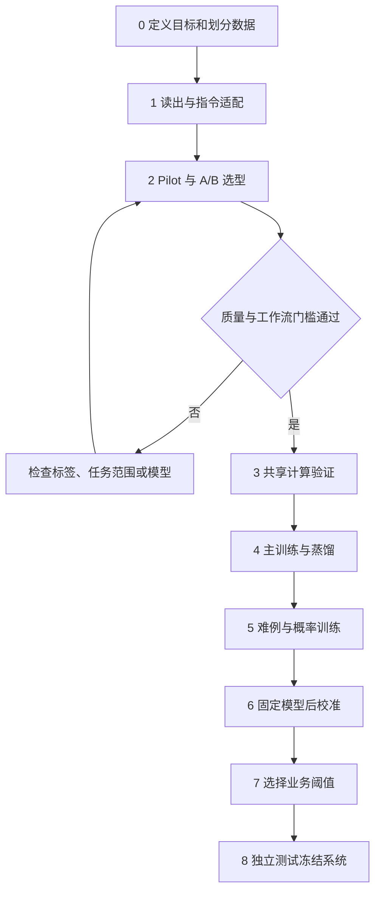

# OpenJev 训练流程与数据合成详解

日期：2026-09-19。状态：训练方案，待执行。数据规模、配比和学习率将在 pilot 中验证和调整。

本文承接[总体设计](openjev_qwen3_design.md)，按执行顺序说明每一步用什么数据、如何合成、优化什么、产出什么，以及何时停止。模型前向结构与工程约束见[模型架构详解](openjev_model_architecture.md)。

## 1. 先看完整流程

整个项目分为 9 个执行步骤，其中真正更新模型权重的是步骤 1、2、4、5。步骤 6 只拟合校准参数，步骤 7 只选择业务策略；其余步骤是准备、工程验证或独立验收。

| 步骤 | 做什么 | 使用的数据／规模起点 | 是否更新模型权重 | 主要目的 | 对应总体里程碑 |
| --- | --- | --- | --- | --- | --- |
| 0 | 定义任务、数据划分、工作流与基线 | 真实业务样本、规则、原始文档及冻结评估集 | 否 | 确定预测目标与成功标准 | M0 |
| 1 | 评分头、结构 token 与决策指令适配 | 2 万–5 万高质量 decision | 是 | 让 Base 学会读问题、读候选、直接打分 | M1 |
| 2 | 小规模多任务 pilot 与架构选型 | 约 10 万唯一训练 decision | 是 | 验证泛化，比较 A／B 和初始化 | M2 |
| 3 | 树形共享等价与性能验证 | 已有小批数据、边界样例及性能输入 | 验证梯度，但不新增能力训练 | 确认优化保持计算目标且有实际收益 | M3 |
| 4 | 主训练与蒸馏 | 累计 50 万–200 万唯一训练 decision | 是 | 扩展任务覆盖和直接决策能力 | M4 |
| 5 | 难例回流与概率质量训练 | 10 万–30 万经验证难例，加普通回放 | 是 | 减少高置信错误和脆弱性 | M4 |
| 6 | 独立后校准 | 独立 calibration，约 2 万–5 万 decision | 否，只拟合温度 | 改善固定模型的概率尺度 | M4／M5 |
| 7 | 工作流阈值与策略选择 | 独立 dev_policy，按完整请求组织 | 否 | 在风险约束内获得有效自动处理覆盖率 | M4／M5 |
| 8 | 冻结系统、最终测试与发布记录 | 最终独立 test | 否 | 验收真实部署版本 | M5 |

步骤 2 内也要执行小规模的“固定模型 → 校准 → 策略选择”预演，以判断工作流是否值得继续投入；不读取最终 test。步骤 4、5 完成后，对最终模型重新执行步骤 6、7。



共享计算没有实际收益时，步骤 3 可以决定保留普通 causal 实现。不能因为 kernel 尚未完成，就推迟能力试验。

## 2. 数据的最小单位与记录方式

### 2.1 一个 decision 是一道完整题

一个 decision 包含：`state + question + complete_candidates + target`。同一 state 下的 6 个问题是 6 个 decision；一道 128 候选题仍然只算 1 个 decision。

数据预算同时报告唯一原始来源数、唯一 state 数、唯一 decision 数、候选 leaf 数和 token 数。候选扩充、翻译、同义改写都不能伪装成新增的独立来源。

建议原始训练记录沿用总体设计，并增加可审计的任务与变换元数据：

```json
{
  "id": "routing-000001",
  "source_group": "policy-family-001",
  "transform_family_id": "case-family-000001",
  "task_family": "support-routing",
  "language": "zh",
  "state": "客户说快递显示签收，但自己没有收到包裹。",
  "question": {
    "type": "choice",
    "instructions": "签收异常首先由物流团队处理。当前应交给哪个团队？",
    "candidates": [
      {"id": "shipping", "text": "物流、签收异常与丢件"},
      {"id": "billing", "text": "扣费、账单与发票"},
      {"id": "returns", "text": "已收到商品后的退换货"}
    ]
  },
  "target": {
    "kind": "verified_hard",
    "label": "shipping",
    "distribution": null,
    "provenance": "routing-rule-v1",
    "quality_weight": 1.0
  },
  "evidence": ["显示签收，但自己没有收到包裹"],
  "teacher_runs": [],
  "metadata": {
    "generator_version": "routing-generator-v1",
    "verifier_version": "routing-verifier-v1",
    "taxonomy_version": "support-v1",
    "input_schema_version": "decision-v1",
    "label_semantics": "policy_determined",
    "transform": "original"
  },
  "split": "train"
}
```

示例将决定路由的规则放进了 instructions。不能依靠只存在于生成器里的私有政策判定学生回答错误。原文证据可输入；evidence 标注、target、教师解释和 metadata 不进入学生输入。

### 2.2 六种 target.kind

| kind | 标签的含义 | 适用来源 | 主损失 |
| --- | --- | --- | --- |
| verified_hard | 经验证、由任务规则或可见证据确定的标签 | 确定性规则、人工审核的明确事实 | 硬标签 CE |
| observed_hard | 一次真实事件或模拟采样结果 | 后续实际结果、随机模拟 | 硬标签 CE |
| verified_distribution | 有明确概率机制或可靠验证的条件分布 | 可枚举模拟器 | 分布 CE |
| human_distribution | 指定人群在固定协议下的标注选择分布 | 多标注者任务 | 分布 CE |
| teacher_soft | 教师给出的候选分布 | 教师蒸馏 | 加权软标签 CE／KL |
| teacher_hard | 教师选择的一个标签 | 仅有教师离散结果 | 加权硬标签 CE |

observed_hard 可以用于学习条件概率，但一次事件不代表真实概率为 1。human_distribution 的预测目标是标注者选择；teacher_soft 的预测目标是教师分布。不能在数据表中把这三种不确定性来源混成“真实概率”。

同一题同时具有可信完整分布和一次采样标签时，优先使用完整分布。不要把同一事件重复计入多个目标，使它在训练中获得意外的额外权重。

## 3. 步骤 0：定义任务、冻结划分和基线

### 3.1 用什么数据

先收集少量有代表性的真实业务材料、业务规则和历史结果，覆盖拟支持的任务：路由、蕴含／证据支持、政策匹配、相关性、实体候选匹配、评分 rubric 与动作选择。

每个任务写清：输入中允许哪些证据、标签究竟指真实事件还是政策选择、候选是否互斥和覆盖、缺失信息如何表达、错误造成什么业务后果。涉及多步计算时优先由代码提供计算结果或执行规则，不让首版模型承担不必要的长算术推理。

### 3.2 合成什么数据

先制作小型验证样例，而不是批量扩增：每个任务包含明确正例、普通负例、相近负例、信息不足、冲突证据和改变候选集合的样例。用它们验证标签协议和编译器。

设计生成器时同时指定保留不用的规则族、模板族、实体群组和任务定义。不能先生成所有近重复句子，再按行随机分成训练和测试。

### 3.3 数据如何划分

| 集合 | 允许用途 | 禁止用途 |
| --- | --- | --- |
| train | 模型训练、蒸馏、难例回流 | 冒充独立评测数据 |
| dev_model | 选架构、学习率、早停、calibrator 形式和分析失败 | 混入训练后仍按原验证成绩报告 |
| calibration | 在固定模型上拟合温度 | 更新 backbone 或评分头 |
| dev_policy | 在固定模型及校准器上选阈值、比较工作流策略 | 作为最终无偏风险结论 |
| test | 仅验收冻结后的完整系统 | 挑架构、改提示、选温度、选阈值、挖训练难例 |

按 source_group、规则族、模板族、实体群组与 transform_family_id 建立隔离。同一原文的翻译、改写、反事实和候选集合变体进入同一集合；存在跨组关联时，按关联后的完整组划分。dev_model 和 test 各自包含未见任务／taxonomy，并互相隔离。

开发期间反复使用 dev_model 和 dev_policy 是选型过程，不是独立验收。若数据有限，在开发数据内使用分组交叉验证，仍保留最终 test。

### 3.4 冻结真实工作流

至少选少量可验证的完整流程，例如“工单分类 → 是否升级 → 选择处理团队”，或“检查资格 → 判断政策 → 执行动作／人工复核”。记录：

- 问题定义、分支代码、允许动作及最终动作真值。
- 自动处理错误率上限、最低覆盖率、错误成本与延迟预算。
- 样本代表的时间、领域、语言和业务先验。
- 独立来源数量及风险区间的估计方式。

门槛在训练前登记为实际数值。本文不凭空指定适用于所有业务的统一正确率或阈值。

### 3.5 建立哪些基线

建立 Base 的受限候选标签概率基线、普通逐候选判别模型，以及后训练版 Qwen3-1.7B 非 thinking 答案基线。保持相同任务信息和工作流；记录是否输出全分布、是否额外生成理由及实际成本。

受限标签打分需说明标签 token 化方式。多 token 标签不能直接当作单 token logits 处理；比较时保持标签映射和概率归一化方法可追踪。随机初始化的新评分头只用于工程对照，不是有意义的零训练能力基线。

**产出与退出条件：**任务蓝图、划分清单、工作流代码规格、基线报告及标签审核规则齐全；生成器和验证器在小样本上没有系统性标签矛盾。

## 4. 数据合成的八类配方

以下 D1–D8 是可复用的数据制作方法。D1–D6 主要描述标签来源；D7、D8 描述变换方式，通常附着在前六类样本上，因此不能简单把八类占比相加。

### D1：从真实文本制作有证据的决策题

**目的：**让模型适应真实表达、噪声和业务词汇，避免只会生成器模板。

**流程：**选择有许可的原始文本 → 提出有明确证据的问题 → 建立候选 → 定位证据 → 独立验证或人工审核。规则类问题必须把必要政策放在可见输入里。

**例子：**工单明确写了“扣款两次”，且任务规定重复扣费归账单团队，则可得到 verified_hard。若仅有“帮我看看订单”而无其他信息，不能硬标为物流。

只有被规则、证据或人工实质审核支持的标签才升级为 verified_hard。通过 JSON 格式检查不构成真值验证；仍仅凭教师意见的记录保留 teacher_hard／teacher_soft。

**使用阶段：**步骤 1–5 的基础数据，并保留独立来源供开发及最终评估。

### D2：先生成事实与规则，再生成自然语言

**目的：**获得可控的反事实、边界条件和可靠硬标签。

**流程：**生成结构化事实 → 运行规则得到答案 → 用不同语言和文风表述事实 → 从成文内容重新核对决定标签的事实 → 再执行规则检查标签。

例如政策为“签收后 7 天内且未使用可以退货”，事实包含天数、是否使用、是否缺少证据。生成 6 天未使用、8 天未使用、6 天已使用等邻近样例，而不总是生成一眼可见的极端正负例。

如果任务判断“根据现有证据是否可批准”，缺少使用状态可以属于证据不足；如果任务预测“最终是否满足条件”，则需要事件标签或条件分布。两种问题不能共用一个含糊标签协议。

**验证：**政策对学生可见；自然语言未更改条件；否定和数字没有被改写丢失；验证器不仅检查隐藏事实。独立抽样人工审核，避免生成器和验证器共享同一种错误。

**使用阶段：**步骤 1 的简单规则，步骤 2、4 的多规则族，步骤 5 的单条件反事实。

### D3：强教师标注和软标签蒸馏

**目的：**迁移较强模型对复杂语义、相关性和候选边界的判断能力。

给教师完整 state、question、候选定义及任务协议，要求返回候选选择、完整概率向量、原文证据、信息不足标记和题目是否不适定。教师可以离线生成解释以便审核；学生只学习最终决策监督。

先由一个教师主标注，第二个独立教师只复核困难样例、分歧和质量抽样。教师身份、revision、提示、采样参数和原始响应全部保存。不要默认对每条题做 16 次采样。

先检查候选映射、概率非负与和为 1，再检查证据和语义。教师分布与可验证真值冲突时优先真值，必要时丢弃或返工该教师标签。教师之间相互同意不自动等于已验证。

口述概率是噪声监督，多次采样频率是教师的采样分布。两者都不能直接替代真实世界条件概率。

**使用阶段：**步骤 2 的小规模消融、步骤 4 的能力扩展、步骤 5 中无确定性验证器的难例复核。

### D4：构造已知条件概率的模拟题

**目的：**让训练集包含真正可验证的概率目标，并检查模型是否会把模糊证据变成过度确定的答案。

先定义隐藏状态 z、可见观测 x、标签 y、先验 P(z) 和观测机制 P(x|z)。能枚举时直接计算：

```text
P(y | x) = Σ_{z: label(z)=y} P(z)P(x|z) / Σ_z P(z)P(x|z)
```

例如模拟诉求有物流 A 和账单 B，先验分别为 0.6／0.4；可见消息“帮我查一下”在 A、B 下出现概率分别为 0.2／0.8。看到这句话后：

```text
P(A | x) = 0.6×0.2 / (0.6×0.2 + 0.4×0.8) = 3/11
P(B | x) = 8/11
```

学生输入只有可见消息和题目，target 使用完整分布。不能把某一次隐藏采样恰好为 A，解释为该输入必然属于 A。

相同观测的自然语言改写必须满足“给定观测后，改写过程不再依赖隐藏类别”，才能直接继承原后验。如果 A 类消息被改写得更像催物流、B 类更像问扣款，改写已经携带新的证据，应重新计算或重新定义目标，不能机械保留 3/11 与 8/11。

跨先验实验也要区分：可见输入包含新业务先验时，模型有条件调整；先验悄悄改变且无任何可见线索时，模型不能从同一输入识别变化，应作为部署漂移问题处理。

**使用阶段：**步骤 2、4、5。它证明的是模拟机制内的概率质量，不替代真实业务校准。

### D5：真实事件或模拟采样的硬标签

**目的：**利用无法枚举完整条件分布、但可以观察最终结果的数据。

保存决策时刻的可见输入 x，再关联事后事件 y，例如在明确定义的时间窗口内是否发生某事件。事后才知道的信息不能回填到模型输入。记录观测窗口、缺失／删失情况、采样方式，以及动作是否影响后续结果。

这类数据使用 observed_hard：

```text
E_{y~P(.|x)}[-log p_theta(y|x)]
  = -Σ_y P(y|x) log p_theta(y|x)
```

因此一次事件可以提供合法训练梯度，但不等于有了真实概率向量。只观察被执行动作的结果会带来选择偏差；需要支持的采样设计或经过验证的修正，不能直接把执行日志当成所有请求的总体标签。

**使用阶段：**有可信观测机制时进入步骤 2、4、5；独立、接近部署分布的记录用于校准和风险评估。

### D6：多标注者分布与主观评分

**目的：**表达明确协议下的人类分歧，例如语气、相关性或描述性 rubric。

固定问题、候选和标注人群，保存每个标注者的结果、有效样本数和审核信息。由标注计数构成分布；样本少的分布不能假装精确已知，报告其有限样本不确定性。

Score 首先写清每档可识别的状态，避免只写“差、一般、好”。真实只有一个经审核等级标签时可以使用硬标签；不能只因为等级有顺序，就凭空给相邻档位分配概率。

教师多次回答不能冒充多位真人标注。目标是特定人群的选择分布，不自动等于客观事件分布。

**使用阶段：**步骤 2、4、5 的有条件来源；没有可信数据时把相应预算转给有真值的数据。

### D7：候选集合变体

**目的：**验证和训练运行时 taxonomy、other 与集合相关判断，也是 A／B 的核心对照数据。

针对同一 x 和 q 构造候选集 C、C'，包括加入新类别、删除某类别后并入 other、拆分粗类别、重叠类别和近义描述。每次变换都要重新推导目标。

如果模拟器知道细粒度类别分布，且候选形成完整互斥划分，可以按映射求和：

```text
r_new(k) = Σ_{y: mapping(y, C_new)=k} P(y | x)
```

例如 A／C 的潜在概率为 0.4／0.6，则 `[A, other]` 为 0.4／0.6，`[A, C, other]` 为 0.4／0.6／0。类别删除后不加兜底时，不能默认对剩余类别重归一化，除非任务明确改成了条件于剩余集合的选择。

候选重叠时先定义优先级或选择协议；如果没有唯一目标，返工任务或保留有明确含义的标注分布。不能用数据清洗悄悄删除所有集合依赖案例，随后宣称 A 已支持通用 Choice。

**使用阶段：**步骤 2 必须包含，步骤 4、5 持续覆盖。所有集合变体与原题同 split。

### D8：成组扰动与反事实

**目的：**让模型关注决定性事实，测量鲁棒性和错误自信。

| 变换 | 如何生成 | 标签处理 |
| --- | --- | --- |
| 同义改写、翻译、别名 | 保留信息内容，审核等价性 | 验证等价后保留目标 |
| 单个决定性条件改变 | 翻转规则条件，例如天数跨过阈值 | 重新执行规则或标注 |
| 删除证据 | 删除真正影响判断的可见字段 | 重新计算条件分布，或按协议转为证据不足 |
| 加入干扰 | 插入无关段落、相似实体 | 验证确实无关后保留目标 |
| 冲突证据 | 同时出现不同来源或时间的矛盾信息 | 按来源／时间规则重标，缺规则则返工 |
| state 内伪指令 | 加入“忽略问题”等作为待分析材料 | 任务 instructions 仍定义判断，但需确认未改变业务语义 |
| 长上下文 | 延长背景，改变证据位置与距离 | 完整保留必要证据并重验 |

删除信息并不保证每个样本熵增加；删去冲突段落可能让答案更确定。不能无条件施加“删信息必须降 confidence”的损失。教师分歧也不自动说明事件具有更高随机性。

**使用阶段：**步骤 1 少量简单对照，步骤 2、4 的系统覆盖，步骤 5 的针对性难例。

## 5. 所有数据共用的质量关口

每条数据进入训练前，依次经过结构验证、语义验证、去重分组和来源审计。结构验证包括唯一 ID、候选数量、目标 ID 存在、概率非负且和为 1，以及分布与候选映射一致。

语义验证按 target.kind 区分：确定性题检查证据是否足以推出标签；概率题检查生成机制或观测协议；教师题检查支持证据及不适定问题。不能因 observed_hard 的结果意外发生，就把合理随机事件误判成标签矛盾。

检查正确项是否总是更长、位置是否固定、文风是否泄漏答案、生成器是否留下隐式类别标记。按任务、语言、候选数和来源抽样人工审核，保存通过率与错误类别；只报告总体通过率可能掩盖某个生成器持续出错。

精确重复、语义近重复、同原文翻译、同模拟事实的表述和反事实家族都需要分组。教师重标和主动回流只能使用训练侧来源，不得把 dev、calibration、dev_policy 或 test 中的失败样例直接补进 train。

下文的数量都指通过这些关口后的样本，不是原始生成数量。教师预算还需计入返工、复核和被丢弃样本。

## 6. 步骤 1：读出头、结构 token 与决策指令适配

### 6.1 目的

让 Base checkpoint 学会自定义输入格式，以及“针对当前问题和候选给出分数”。模型必须理解同一个 state 可以被问不同问题，同一个候选名称也可以在不同任务中有不同定义。

这一阶段不做聊天 SFT，不学习生成教师的解释，也不要求先学会输出 JSON。

### 6.2 用什么数据，合成什么数据

使用 2 万–5 万高质量 decision，主要来自 D1、D2。一个可执行的起始任务配比是 Choice 50%、Noul 30%、Score 20%，属于待验证的采样方案；标签以可靠硬标签为主，不在此阶段依赖大量教师口述概率。

输入先以较短文本为主；Choice 主要 2–8 项，Score 2–5 档。不能只生成“明显正确项 + 几个完全无关选项”，应保留少量相近负例。

必须包含以下配对题：

| 配对方式 | 合成示例 | 要验证的能力 |
| --- | --- | --- |
| 同 state，不同问题 | 同一工单分别问“负责团队”和“是否明确要求退款” | 模型读取问题，而非只给 state 固定标签 |
| 同 state、question，不同候选定义 | 改变部门职责，同时在可见描述中写清新职责 | 模型读取候选语义，而非记住 shipping 等名称 |
| 同规则，改变单个事实 | 签收异常改成重复扣费 | 答案随决定性事实改变 |
| 同事实，不同表达 | 改写、翻译、口语化 | 表面文风不决定答案 |
| 清楚的 Score rubric | 明确无影响／有替代方案／完全阻断 | 学习匹配具体档位描述 |

不依赖“标题更长的选项通常正确”等捷径。任务配比、语言和候选数分别统计，不能把某种语言与某种标签固定绑定。

### 6.3 训练分为两个子步骤

**1a：短暂读出热身。**冻结 backbone，只训练新评分头与新增结构 token 的 embedding。head／新 embedding 的 LR 从 1e-4–5e-4 试起，以 dev_model NLL 和梯度稳定性调整。热身只需确认新接口能学到有效信号，不预设必须把整个 2 万–5 万题反复跑完。

旧 embedding 行不仅要禁止梯度更新，还应避免被优化器的 weight decay 或动量状态改变。可以单独参数化新增行，或使用经过检查的行级更新机制。只把旧行梯度置零而仍对整张 embedding 做 AdamW 更新不够。

**1b：决策指令适配。**解冻顶层 4–8 层或启用 LoRA，再训练同一批高质量题。前者与后者是预算下的备选实验，需保存明确配置，不混称为相同训练方式。backbone LR 可从主训练量级 1e-5–2e-5 试起，新 head 保持较高 LR，并按验证结果调整。

主损失为按题 CE；有可信完整分布的少量样本可以使用分布 CE。冻结主干时损失不降先检查读出位置、候选映射和新 token，而不是立即扩大数据。

### 6.4 产物与退出条件

产出适配 checkpoint、tokenizer／编译器版本、优化器配置和配对题评估。dev_model 必须展示问题／候选定义改变后预测会相应变化，并在未见指令改写上优于无效或简单捷径基线。

训练准确率高但未见问题失败时，补充指令对照或调整解冻策略。不能仅凭训练集拟合很好进入扩量。

## 7. 步骤 2：约 10 万题 pilot 与架构选型

### 7.1 目的

这一阶段回答三个决定是否继续投入的问题：1.7B Base 的直接判别能力是否足够；独立候选 A 是否满足目标业务；概率输出能否在真实工作流里换来有效覆盖率。

使用普通 causal forward 训练和评估，不等待树形 kernel。A／B 的训练数据和监督一致，各自编译输入；固定随机种子组，记录计算量和训练 token 差异。

### 7.2 用什么数据，合成什么数据

累计约 10 万唯一训练 decision，可包含步骤 1 的已去重样本。pilot 以可验证数据为主，以下是可调整的起始来源配比：

| 来源 | 起点占比 | 主要合成内容 |
| --- | --- | --- |
| D1／D2／可信 D5 | 60% | 真实材料、规则族、实体候选和可靠事件标签 |
| D3 教师监督 | 20% | 较复杂的语义匹配、相关性和含糊表达 |
| D4 已知条件分布 | 15% | 不同观测强度、隐藏状态和先验机制 |
| D6 人类分布 | 5% | 有协议的主观 rubric；没有时转给可信真值数据 |

这是 pilot 的质量优先配比；后续主训练的起始配比不同。约 20%–30% 的样本可带 D7／D8 变换标记，包含在上面的 100% 中，不额外重复计算。

Choice 从 2–8 项逐步加入 17–64 项，保留少量 65–255 项以暴露高候选数问题。不能只在小 K 上选定架构，再把结果外推到 255 项。B 若因完整列表超过长度／显存预算，应单独记录为工程和支持范围问题。

pilot 默认从适配 checkpoint 继续全参数训练，backbone LR 从 1e-5–2e-5、head LR 从约 1e-4 试起，运行 1–2 次遍历并以 dev_model 早停。预算不足时可统一改用 LoRA 做方向验证，但各架构对照必须保持相同可训练模块与适配预算，并把全参能力留为后续待验证项。使用混合的硬标签／分布／教师 CE；此时先不叠加 Brier 和 consistency，以便判断数据与候选结构的独立作用。

### 7.3 必做实验

| 实验 | 数据控制 | 重点观察 |
| --- | --- | --- |
| Base vs 后训练版初始化 | 同训练记录、优化预算与评估协议 | 未见任务、NLL 和工作流质量 |
| A vs B | 同 Choice 原题与候选集合变体 | other、动态 taxonomy、重叠类别 |
| 硬标签 vs 加教师软标签 | 保持验证真值相同，记录样本数与来源 | 是否只提高教师一致性而伤害真实质量 |
| 不含／含已知概率题 | 固定其余数据或明确替换规则 | 条件概率恢复、高置信错误和风险 |

不要求做所有因素的完整笛卡尔积。先用固定小预算筛选关键差异，再对候选方案重复验证；不得用不同任务信息包装制造“更公平”的名义比较。

NLL、Brier、准确率及校准按领域、语言、K、长度、未见任务单独报告。高置信错误中的“高置信”用预先规定的 top probability 条件定义，不使用跨 K 不可比的集中度。

### 7.4 工作流预演与阶段门槛

对候选 checkpoint 冻结权重，用独立 calibration 拟合简单温度，再在 dev_policy 选择策略。评估真实流程的最终动作错误、覆盖率、人工复核与成本，检查实际分支子集。

必须在扩量前确认：

1. 未见任务达到步骤 0 登记的质量门槛，能排除只记住模板的解释。
2. A／B 选型覆盖声明支持的语义。若 A 不支持动态 other，应改 B 或明确缩小范围。
3. 工作流在开发数据上显示达到目标风险和最低覆盖率的可行性，样本量能支持这一判断。
4. 高 K、较长文本和关键语言没有被总体平均分掩盖的严重失败。

这只是 go/no-go 的开发证据，不是最终无偏风险报告。若样本不足，结果是“尚不能判断”，应补代表性验证数据，而不是把零错误当成可靠。

**产出：**选定的 Choice 模式、初始化选择、数据消融报告、支持范围和继续／返工决定。需要返工时只在开发数据上分析和重做。

## 8. 步骤 3：共享计算的工程验证

### 8.1 目的与数据

步骤 3 不靠新增语义数据提升能力。取 pilot checkpoint 和覆盖不同 S／Q／K 的现有小批次，加入多请求隔离、padding、路径位置、特殊 token、非法候选和数值边界样例。

先验证小型明确 mask，再评估稀疏后端；比较普通参考与树形实现的 logits、同题 loss 和梯度。对照时关闭随机算子或控制为等价随机行为，明确 FP32／BF16 容差。

### 8.2 必须通过什么

共享前缀梯度等于参考副本梯度之和，完整候选分母不变。物理打包顺序变化不能改变映射回原 ID 的输出。A 的兄弟 raw logits 隔离断言不能错误套用到 B。

性能评估包含可用的普通前缀缓存基线，记录最长路径、总 token、并发和峰值显存。如果只是理论稀疏率好看，实际更慢，就保留参考后端。

**产出与退出条件：**数值／梯度等价报告、后端选型和硬件 profile。发现训练目标不等价时停止扩量，先修复工程实现。

## 9. 步骤 4：主训练与蒸馏

### 9.1 目的

在 pilot 已验证的结构上扩展任务、领域、语言和候选定义覆盖。主要提升对新问题的直接判断能力，不把大数据量本身当成质量指标。

### 9.2 用什么数据

累计 50 万–200 万唯一训练 decision，已验证的 warmup／pilot 样本可以作为其中一部分。第一轮主训练来源的起始配比如下，以 100 万题为例：

| 来源 | 比例 | 100 万题中的数量 | 主要作用 |
| --- | --- | --- | --- |
| D1／D2／可信 D5 的硬标签 | 40% | 40 万 | 保持真实证据和可验证任务的基础能力 |
| D3 教师标签 | 35% | 35 万 | 扩展复杂语义和任务覆盖 |
| D4 已知条件分布 | 15% | 15 万 | 提供可信的概率监督 |
| D6 人类分布或有明确依据的边界分布 | 10% | 10 万 | 表达定义清楚的主观分歧或边界不确定性 |

每条样本只归入一个来源桶。例如由模拟器计算的边界分布属于 D4，不再重复计入最后一行。没有可信人类／边界分布时，将最后 10% 转给真值数据，得到 50%／35%／15%／0%，不能用教师数字凑满。

D7／D8 变换样本约占全体的 20%–30%，已包含在来源比例中。中英先以约 1:1 建立覆盖，之后依据实际业务调整；同一原文及译文必须同 split。

Choice 的候选数起点为：2–4 占 40%，5–16 占 40%，17–64 占 15%，65–255 占 5%；该比例只在 Choice 子集内统计。Score 使用 2–10 档，Noul 二元。高 K 需要独立的显存预算，不能靠丢弃候选来节省训练成本。

上下文先以 256–2048 tokens 为主，在验证质量后逐步加入 4K–8K。长上下文变体要改变证据位置、加入相似实体和多段干扰，不只是重复无关句子凑长度。

### 9.3 合成什么新数据

扩量优先增加新的任务定义、规则族、真实来源、实体和困难负例，而不是把同一题改写几十次。

D2 扩展规则组合及业务词汇；D3 用于没有廉价验证器的语义任务；D4 增加不同观测机制；D7 增加真实 taxonomy 变动；D8 增加语言、上下文位置和冲突证据。每轮记录这些新增维度，证明增加的是覆盖而不只是行数。

教师额外预算优先给不适定题、证据冲突、低质量标签和学生当前薄弱任务。不要求所有题多次采样，节省的预算用于真值审核与独立来源。

### 9.4 如何训练

推荐主 checkpoint 最终全参数训练；算力有限时可先 LoRA 验证，但不能假定与全参质量等价。起始配置：

| 项目 | 起点 |
| --- | --- |
| backbone LR | 1e-5–2e-5 |
| head LR | 约 1e-4 |
| 优化器 | AdamW |
| warmup | 总更新步数约 3% |
| gradient clip | 1.0 |
| 主计算精度 | BF16 |
| log_softmax／loss 归约 | FP32 |
| 训练轮数 | 1–2 次遍历，以 dev_model 早停 |

batch 按路径长度、总 token 和候选数分桶。记录每次更新的有效 decision 数与来源比例；不能仅记录候选 leaf 数后把它当作 batch size。

教师样本的相对 loss 权重从 0.3–0.5 试起，后期可降低到 0.1–0.2。具体加权方式见第 15 节。高质量真值优先于冲突教师意见；已知分布优先于同题的一次采样硬标签。

### 9.5 产物与退出条件

产出主训练 checkpoint、数据 manifest、来源／变换统计和分组学习曲线。使用 dev_model 选择 checkpoint；保留单题与工作流开发评估，检查真实标签质量是否被教师拟合掩盖。

如果扩量只提升训练集准确率，或教师一致性提高但真实任务变差，先检查数据来源与权重。不要继续机械增加 epoch。

## 10. 步骤 5：难例回流与概率质量训练

### 10.1 目的

修复当前模型实际暴露的高置信错误、候选混淆、语言／长度弱点和输入扰动不稳定，同时保留普通样本能力。

### 10.2 用什么数据，如何找到难例

在训练侧来源的已标注池和未标注池运行模型，筛选：

- 有可靠标签时：错误且 top probability 高、NLL 高、Score 业务边界判断错误。
- 未标注时：教师分歧、预测不稳定、模型与规则／检索证据冲突，只作为送审线索。
- 覆盖不足时：新领域、新 taxonomy、长上下文和稀有但有业务影响的类别。

没有标签时不能直接声称已找到了“高置信错误”或计算真值 NLL。候选必须经 D1／D2 验证或 D3／D6 复核后，才能进入训练。

引入 10 万–30 万经验证难例，训练采样中约一半为普通回放。假设一轮覆盖 10 万难例，可搭配约 10 万普通样本曝光；这不表示又新增了 10 万唯一来源。回放保持主要任务、语言与类别先验的覆盖。

### 10.3 合成什么数据

围绕每个已确认失败模式生成小规模 D7／D8 家族：更换混淆实体、翻转决定条件、删除关键证据、增加近义候选、改变 other 的补集或延长上下文。标签重新计算，不盲目复制原答案。

发现问题来自候选描述不适定时先修复任务协议，而不是强迫模型拟合矛盾标签。发现问题来自生成器偏差时修复该数据来源并重新审核。

### 10.4 如何训练

从主训练选出的 checkpoint 继续，保留其可训练模块范围；主线为全参，若主训练采用 LoRA 则继续同一 adapter 配置。LR 从约 2e-6–5e-6 试起，主目标保留 CE。可以在可信硬标签或可信分布上加入 Brier，权重从 0.1 试起；是否保留由消融决定。

对验证过的同义配对可以加入较小的 JS consistency。修改决定性事实、删去关键证据和改变候选集合导致目标改变的配对，不能施加相同分布约束。

困难样本的采样分布有意偏离部署分布，因此它们不能直接充当后校准集。也不能用全是难例的验证集合代表正常业务风险。

### 10.5 产物与退出条件

产出最终待校准 checkpoint、失败模式修复记录及普通回放退化报告。难例改善必须同时检查普通任务准确率、NLL、Brier 和工作流开发指标。

若模型只是把所有概率拉平，可能降低某些高置信错误计数，却也失去自动处理覆盖率。必须在风险与覆盖率上共同判断，不能只看一个校准指标。

## 11. 步骤 6：独立后校准

### 11.1 目的与前置条件

模型权重和输入编译规则已经固定。此时要调整的是概率尺度，不再学习新的任务能力。训练用 T=1；校准阶段拟合 T>0，使模型在目标分布上的概率更符合结果频率。

### 11.2 用什么数据，是否需要合成

使用独立 calibration，数量起点约 2 万–5 万 decision，接近实际部署的领域、语言、候选数、长度、难度和类别先验。优先采用真实可验证标签或可靠事件结果。

主训练中刻意均衡的语言、类别或困难样本比例，不应未经检查直接复制为校准比例。需要分组校准时先确认每组样本量；不能给每个稀有任务都拟合一个不稳定的温度。

这一阶段不以合成数据扩量为主要工作。D4 可以单独检验模拟环境内校准；若用合成样本补充真实业务缺口，必须分开报告，不能据此声称真实部署已校准。教师软标签拟合得到的是教师一致性，不能替代真实校准目标。

### 11.3 如何拟合

保存每题固定 logits 与真值，按 primitive 拟合少量温度：

```text
T_type = exp(tau_type)
p_i = softmax(z_i / T_type)
L_calibration = mean_i[-log p_i(y_i)]
```

若有可信完整目标分布 r_i，将每题目标替换为 `-Σ_k r_ik log p_ik`。普通事件硬标签不需要先人为平滑为软分布。

温度只能改变分布尖锐程度，不能修复错误排名。需要更复杂 calibrator 时，用 dev_model 或开发数据内交叉验证选择形式，再按固定方案拟合参数；最终 test 不参与选择。

### 11.4 产物与退出条件

产出温度参数、拟合数据版本、模型／精度／编译器绑定信息，以及开发数据上的校准前后 NLL、Brier、可靠性图和分组结果。

部署量化、adapter、权重或输入编译变化可能改变分布。正式验收前应针对实际部署版本重做本步骤和步骤 7，不能把旧温度与新 logits 拼接成一个未验证系统。

## 12. 步骤 7：业务阈值与完整工作流验证

### 12.1 目的

把模型概率转换成业务可执行的策略：哪些请求自动处理，哪些需要人工复核。一个预测器的总体校准良好，并不意味着任意阈值、任意工作流组合都安全有效。

### 12.2 用什么数据，合成什么数据

使用独立 dev_policy，以完整请求／工作流实例组织，包含同一请求的所有问题和最终动作真值。保留分支执行轨迹，不能只存被模型选中的一道题。

主数据接近部署分布。可额外合成故障场景、稀有规则冲突、候选缺失和上游误判，组成单独的压力测试集；这些定向合成样本不与正常流量混合后估计总体风险。

### 12.3 如何选择策略

Choice 以 top probability 等已验证量为候选阈值依据；Score 优先看与业务边界相关的概率，Noul 可以设正向、负向和人工复核区间。不能把 distribution_concentration 当成跨 K 的统一正确率。

为每个候选策略运行固定工作流，计算：

```text
自动处理覆盖率 = 自动处理请求数 / 有效请求总数
自动处理错误率 = 自动处理中的错误动作数 / 自动处理请求数
人工复核率 = 进入人工复核的请求数 / 有效请求总数
每请求成本 = 错误动作成本、人工成本及其他已定义成本之和 / 请求总数
```

没有自动处理样本时，自动处理错误率不可估计，不能记为零错误达标。不同类别错误的后果不同，应使用步骤 0 固定的成本定义，并对重要类别单独报告。

在预先声明的风险限制内选择覆盖率较高、成本可接受的策略。阈值搜索的开发结果可能乐观，需要步骤 8 独立验收；普通区间估计不会自动抵消反复搜索的偏差。

### 12.4 检查条件分支和联合判断

例如工作流要求“身份匹配”和“政策允许”都成立才行动。两个问题各输出 0.95，不代表最终动作正确率为 0.95，也不能未经验证直接取 0.95²。

attention 隔离是计算结构，错误可以因同一个缺失证据而相关。应直接评价最终动作风险，并在“上游判断通过”的子集里检查下游概率与错误率。需要联合概率时使用有标签的联合任务或明确建模并验证依赖关系。

### 12.5 产物与退出条件

产出固定阈值、分组规则、工作流版本、风险／覆盖率曲线及各分支样本量。最终策略应达到预登记的开发门槛；样本不足的分支明确保留为人工处理或未验证范围，不能在最终报告中省略。

阈值、校准器和模型共同构成部署系统。仅替换其中一个都要重新检查工作流行为。

## 13. 步骤 8：最终测试与发布记录

### 13.1 用什么数据

只使用最终独立 test。它包括代表性部署样本、来源隔离的未见任务／taxonomy，以及单独标记的 OOD／压力测试。合成评测和真实业务评测分别报告。

进入这一步前，冻结权重、tokenizer、编译器、Choice 模式、推理后端、dtype／量化配置、温度、阈值和工作流。若需要 serving 或量化优化，先完成并重做校准及策略选择，再读取 test。

### 13.2 报告什么

| 层面 | 指标与证据 |
| --- | --- |
| 单题判断 | accuracy、NLL、Brier；Score 的分布、排序和均值误差 |
| 概率质量 | top-label／classwise calibration、可靠性图、AURC、覆盖率—错误率曲线 |
| 关键分组 | 领域、语言、候选数、长度、未见任务、OOD、条件分支 |
| 完整工作流 | 最终动作错误、覆盖率、人工复核、每请求成本和风险区间 |
| 工程正确性 | 参考等价、输入隔离、输出合法性和数值异常处理 |
| 效率 | GPU、软件版本、batch／并发、冷启动／稳定态、P50/P95、吞吐和显存 |

固定阈值处的风险需要置信区间，低错误目标需要足够多已自动处理的样本。对于真正独立的 n 个自动处理样本，零错误时单侧 95% 二项上界为 `1 - 0.05^(1/n)`，大 n 时约为 `3/n`。例如 n=3000 时约为 0.1%，并非证明真实错误率为零。同一来源含多题或同一客户多次请求时不能直接把每题当独立样本，应按来源处理相关性。

覆盖率—风险曲线可以作为预先定义的测试报告项目，但不能看完曲线再为本次发布挑新的“最佳阈值”。需要调整时回到开发流程，旧 test 已提供反馈，下一次独立验收需要未使用的数据。

### 13.3 产物与退出条件

产出冻结模型包、完整配置清单、数据版本、最终报告、支持范围和已知失败模式。是否达标按步骤 0 的数值门槛判定，不能把“超过某个较弱基线”自动等同于可以部署。

发布后收集的业务反馈进入下一轮版本的数据流程；先做来源隔离和标签审核，不直接在线改温度或阈值却继续沿用旧评估报告。

## 14. 数据规模如何计算，避免重复预算

| 数据池 | 数量含义 | 与其他阶段的关系 |
| --- | --- | --- |
| warmup | 2 万–5 万唯一 train decision | 可作为 pilot 的子集 |
| pilot | 累计约 10 万唯一 train decision | 可作为主训练的子集 |
| main | 累计 50 万–200 万唯一 train decision | 包含先前保留的合格训练题，不是再无条件相加 |
| hard refinement | 10 万–30 万经验证难例 | 报告其中已有题与新题各多少；去重后新增部分才计入总量 |
| ordinary replay | 难例训练中约一半的曝光 | 通常来自既有 train，不算新增唯一数据 |
| calibration | 独立约 2 万–5 万 decision | 不包含在主训练数量内 |
| dev_model／dev_policy／test | 由任务覆盖和风险估计精度决定 | 与 train 来源隔离，分别计费和统计 |

按候选数估算成本时，不能只用平均 K。高 K 样本虽然占比低，候选描述和 attention 成本仍可能占很大部分。每轮同时报告：原始 token、按路径复制的参考 token、共享后的节点 token、最长路径及教师输入／输出成本。

同一个 state 上增加多个问题可以提高前缀复用，但不能把高度相关的题当成同等数量的独立验证证据。

## 15. 损失函数与 batch 的实现约定

### 15.1 每题先做完整归一化

对第 i 题的完整有效 logits z_i：

```text
log_p_i = log_softmax(z_i)                 # 训练时 T=1
L_hard_i = -log_p_i[y_i]
L_dist_i = -Σ_k r_ik log_p_ik
L_teacher_i = -Σ_k q_ik log_p_ik
```

教师软标签 CE 与 `KL(q || p)` 对学生参数的梯度相同，相差仅与教师有关的常数。实现选择一种即可，不能把两者都加上造成重复计权。

每题主目标只选择适用的一项：可信完整分布、可靠硬标签或教师标签。teacher_hard 使用硬标签形式，但保留教师来源权重。

### 15.2 可选的概率与一致性损失

```text
L_Brier_hard_i = Σ_k (p_ik - 1[y_i=k])²
L_Brier_dist_i = Σ_k (p_ik - r_ik)²
L_pair = JS(p_original, aligned(p_equivalent))
```

分布 Brier 与逐事件 Brier 的条件期望只相差模型无关常数。Brier 首先只在可信监督样本上评估，不通过给教师概率增加更多损失项就把它变成真值。

JS 配对先按候选 ID／语义映射对齐；只用于确认等价的输入。物理打包不变性属于工程正确性，不应靠 consistency loss 掩盖 mask 或 position 错误。

### 15.3 归约和来源权重

令 a_i 是预先定义的题／状态／任务权重，s_i 是标签质量权重乘以来源系数。真值来源系数起点为 1，教师来源系数起点为 lambda_teacher：

```text
L_main = Σ_i a_i s_i L_target_i / Σ_i a_i
```

分母不把来源系数 s_i 再归一化掉，否则在纯教师微批上可能使 lambda_teacher 失效。来源占比、来源系数与质量权重分别记录，不能把“35% 教师题”误解成“35% 教师梯度”。

默认每题权重相同；若一个 state 的问题数量相差很大，可按预先约定的状态／任务权重聚合。无论选择哪种，训练、参考对照和树形实现都必须一致。候选多的题不因为 leaf 更多就自动得到更多权重。

先明确一次完整优化更新的有效题权重总和，再正确缩放微批和分布式归约。不能对大小悬殊的微批分别求均值后直接等权相加。Brier 与配对损失使用各自明确的有效样本归约，并通过显式 lambda 控制。

### 15.4 为什么首版不使用 PPO／GRPO

首版主要目标有可微分布和可用标签，CE／Brier 可以直接反向传播。普通“选对奖励 1、选错奖励 0”会鼓励确定地选多数答案，并不要求动作采样概率等于真实事件概率。

这些步骤称为校准决策训练，不声称复现官方 RLCD。只有任务确实需要环境交互、反事实 outcome 或探索时，才另设强化学习研究；预测结果概率与优化动作收益必须区分。

## 16. 每一轮实验应该交付什么

实验产物按以下结构组织：

```text
experiment/
  manifest.json              # 模型、软件、数据、编译器、种子和预算
  task_blueprints.jsonl      # 任务定义、真值协议与支持范围
  split_manifest.jsonl       # 来源组和变换家族的划分
  data_stats.json            # 唯一来源、decision、leaf、token 及审核统计
  checkpoint/                # 权重、评分头和 tokenizer
  calibration.json           # 温度和绑定的模型版本
  policy.json                # 阈值与工作流版本
  reports/                   # 当前阶段允许使用的数据上的评估结果
```

步骤 0–5 不应提前生成基于最终 test 的调试报告。每轮记录停留或进入下一阶段的理由：是模型能力、数据质量、概率尺度、策略还是工程性能造成的限制，避免用更多数据替代问题定位。

## 17. 建议的第一轮执行范围

先完成步骤 0–2：固定少量真实工作流，制作 2 万–5 万题适配集并累计扩到约 10 万题，使用普通 forward 验证指令理解、A／B 候选结构、可信概率监督与工作流价值。

这轮结束应能回答“当前 1.7B 模型在什么任务范围内有用、哪种候选结构合适、需要哪些数据才能改善”。在这些问题没有证据之前，不启动百万题全量合成，不把树形 kernel 或复杂 RL 当成下一步默认答案。

数据与概率原则承接[总体设计](openjev_qwen3_design.md)，其中保留了严格适当评分规则、温度校准以及官方资料的来源链接。本文新增的具体采样配比和执行细节属于实验建议，任何调整都应通过开发数据验证并记录版本。
